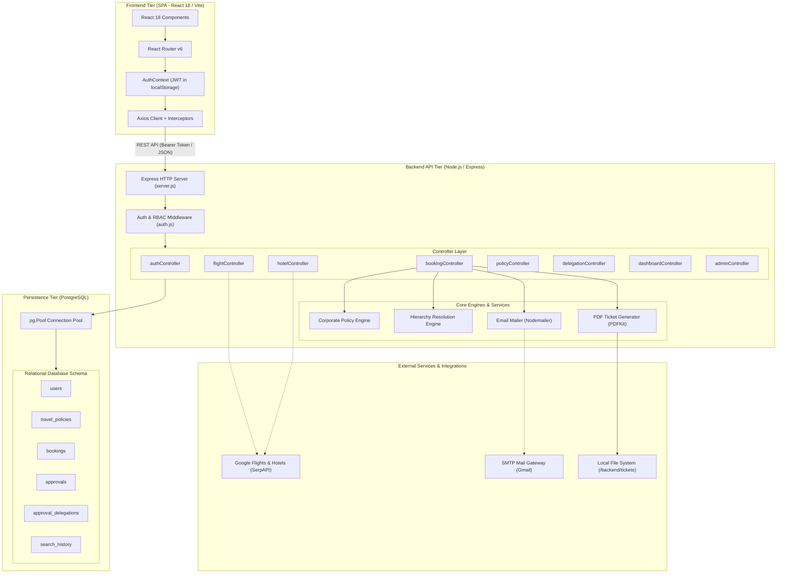
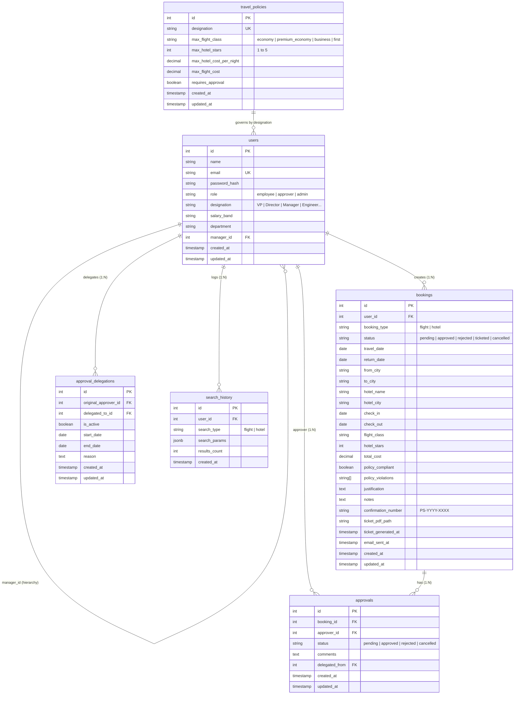
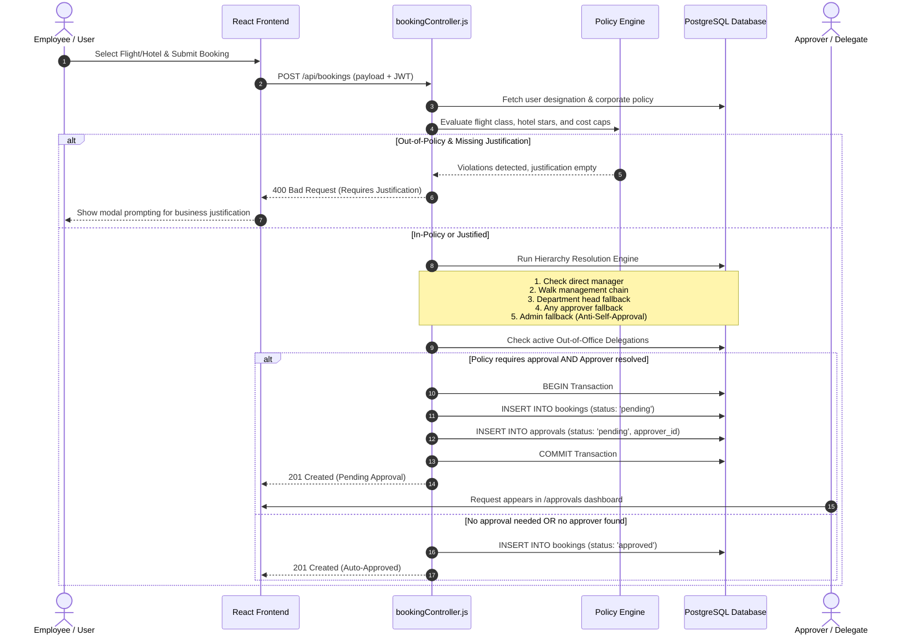
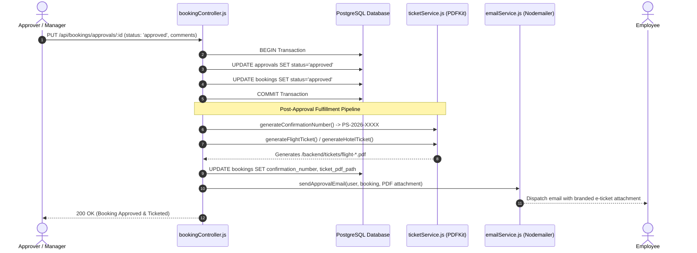

# 🌅 Project Sunrise — System Architecture & Technical Documentation

> **Platform:** Project Sunrise (Enterprise Corporate Travel Management & Compliance Platform)  
> **Version:** 1.0.0  
> **Last Updated:** September 2026  

---

## 📑 Table of Contents
1. [System Overview & Purpose](#1-system-overview--purpose)
2. [High-Level Architecture](#2-high-level-architecture)
3. [Component & Tier Breakdown](#3-component--tier-breakdown)
   - [3.1 Presentation Tier (Frontend SPA)](#31-presentation-tier-frontend-spa)
   - [3.2 Application & API Tier (Node.js / Express)](#32-application--api-tier-nodejs--express)
   - [3.3 Persistence Tier (PostgreSQL)](#33-persistence-tier-postgresql)
   - [3.4 External Services & Integrations](#34-external-services--integrations)
4. [Database Entity-Relationship (ER) Architecture](#4-database-entity-relationship-er-architecture)
5. [End-to-End Workflow & Sequence Diagrams](#5-end-to-end-workflow--sequence-diagrams)
   - [5.1 Search, Policy Validation & Booking Submission](#51-search-policy-validation--booking-submission)
   - [5.2 Manager Approval & Post-Approval Fulfillment Pipeline](#52-manager-approval--post-approval-fulfillment-pipeline)
6. [Core Business Engines Deep-Dive](#6-core-business-engines-deep-dive)
   - [6.1 Corporate Policy Engine](#61-corporate-policy-engine)
   - [6.2 Intelligent Approval Routing & Hierarchy Engine](#62-intelligent-approval-routing--hierarchy-engine)
   - [6.3 Out-of-Office (OOO) Delegation Engine](#63-out-of-office-ooo-delegation-engine)
   - [6.4 Dynamic PDF Ticket Generation (PDFKit)](#64-dynamic-pdf-ticket-generation-pdfkit)
   - [6.5 Email Notification Service (Nodemailer)](#65-email-notification-service-nodemailer)
7. [Security & Access Control Architecture](#7-security--access-control-architecture)
8. [API Route & Controller Specification](#8-api-route--controller-specification)
9. [Directory Structure](#9-directory-structure)

---

## 1. System Overview & Purpose

**Project Sunrise** is an enterprise corporate travel booking, policy governance, and expense compliance platform. It bridges corporate travel booking with financial governance by:
- Enabling employees to search real-time flights and hotels via Google Flights and Google Hotels (SerpAPI) or offline inventory.
- Enforcing designation-based corporate travel policies in real time (flight class caps, hotel star limits, and per-night/ticket expenditure ceilings).
- Mandating business justifications for out-of-policy travel requests.
- Routing approvals through an intelligent organizational hierarchy with anti-self-approval mechanisms and out-of-office delegation.
- Automatically generating branded PDF boarding passes/vouchers upon approval and delivering them via email.
- Giving administrators complete oversight through spend analytics, policy configuration, and user management.

---

## 2. High-Level Architecture

The platform follows a **Three-Tier Architecture** with decoupled presentation, application logic, and persistence layers, augmented by external search APIs, an SMTP mail gateway, and a document generation engine:



---

## 3. Component & Tier Breakdown

### 3.1 Presentation Tier (Frontend SPA)
* **Framework:** React 18, bundled using Vite.
* **Routing:** `react-router-dom` (v6) with client-side route guarding via `<PrivateRoute>`.
* **State Management:** React Context API (`AuthContext` for user session & token management, `ThemeContext` for light/dark theme switching).
* **Styling & Icons:** Tailwind CSS with modern corporate typography, Lucide React icons, and `react-hot-toast` for micro-feedback notifications.
* **HTTP Client:** Axios instance with request interceptors (attaching JWT authorization headers) and response interceptors (handling token expiration and redirecting to `/login`).

### 3.2 Application & API Tier (Node.js / Express)
* **Framework:** Express.js REST API with JSON body parsing, URL-encoded payload handling, and CORS middleware configured for allowed origins.
* **Authentication & Authorization:** Stateless JSON Web Token (JWT) verification with role-based authorization (`employee`, `approver`, `admin`).
* **Transaction Management:** Relational transactions (`BEGIN`, `COMMIT`, `ROLLBACK`) managed through `pg.Pool` clients to guarantee atomicity when creating bookings, updating approvals, or configuring delegations.
* **Background Fulfillment:** Asynchronous PDF ticket rendering and SMTP dispatch decoupled from core database commits.

### 3.3 Persistence Tier (PostgreSQL)
* **RDBMS:** PostgreSQL relational database with relational integrity, cascading foreign keys, unique constraint indexes, and check constraints.
* **Connection Pooling:** Managed through `pg.Pool` with connection reuse and error handling.
* **Migrations & Seeds:** Self-contained migration scripts (`npm run migrate`) and comprehensive database seeders (`npm run seed`).

### 3.4 External Services & Integrations
* **SerpAPI:** Connects to Google Flights engine and Google Hotels engine for real-time rates, routes, and hotel star ratings.
* **Nodemailer:** Transports HTML confirmation/rejection notices via Gmail SMTP with PDF vouchers attached.
* **PDFKit:** Programmatic vector graphics and typography engine producing customized flight boarding passes and hotel confirmations.

---

## 4. Database Entity-Relationship (ER) Architecture



---

## 5. End-to-End Workflow & Sequence Diagrams

### 5.1 Search, Policy Validation & Booking Submission



---

### 5.2 Manager Approval & Post-Approval Fulfillment Pipeline



---

## 6. Core Business Engines Deep-Dive

### 6.1 Corporate Policy Engine
The policy engine (`policyController.js`) maps an employee's organizational designation to travel allowances:
* **Flight Class Constraints:** 
  * `economy`: Restricted to economy only.
  * `premium_economy`: Economy and premium economy.
  * `business`: Economy, premium economy, and business class.
  * `first`: All classes allowed.
* **Hotel Star Ceilings:** Restricts hotel star ratings (e.g., 3-star maximum for Junior Engineers, 5-star for Vice Presidents).
* **Cost Maximums:** Enforces hard caps on flight ticket prices (`max_flight_cost`) and hotel room nightly rates (`max_hotel_cost_per_night`).
* **Pre-Flight Validation:** Exposed via `POST /api/policies/validate` for real-time frontend compliance badges and warning alerts before checkout.

### 6.2 Intelligent Approval Routing & Hierarchy Engine
Implemented in `bookingController.js`, the routing engine prevents circular approval loops and self-approvals:
1. **Anti-Self-Approval Rule:** An approver cannot approve their own travel booking under any condition.
2. **5-Stage Hierarchy Resolution:**
   * **Stage 1 (Direct Manager):** Resolves the employee's `manager_id`. If that manager has role `approver` and is not the employee, assign to them.
   * **Stage 2 (Management Chain Traversal):** Iteratively climbs up the management chain (`manager.manager_id`) until an active approver is found. A visited set prevents infinite loops.
   * **Stage 3 (Department Head Fallback):** Finds the highest-ranking approver in the same department (ordered by precedence: `VP` > `Senior Manager` > `Manager`).
   * **Stage 4 (Global Approver):** Resolves any active approver in the enterprise (excluding the requester).
   * **Stage 5 (Administrator Fallback):** Assigns to an admin if no intermediate approver can be reached.

### 6.3 Out-of-Office (OOO) Delegation Engine
Managed via `delegationController.js`:
* Approvers can establish temporary delegation rules specifying `delegated_to_id`, `start_date`, and `end_date`.
* When a booking is routed to an approver who has an active delegation window:
  1. The engine checks that the delegate is not the employee who created the booking.
  2. The approval is assigned directly to the delegate.
  3. The `delegated_from` foreign key records the original approver for auditability.
* Prevents circular delegation loops and self-delegations.

### 6.4 Dynamic PDF Ticket Generation (PDFKit)
The ticketing service (`ticketService.js`) creates professional PDF boarding passes and vouchers:
* Generates a corporate header, reservation title, and unique confirmation number (`PS-YYYY-XXXX`).
* Renders flight route grids, departure/arrival times, aircraft types, cabin classes, and passenger details.
* Renders hotel vouchers with check-in/out dates, guest counts, room classifications, and policy compliance badges.
* Draws vector boarding pass borders, tear-off divider lines, and barcode representations.

### 6.5 Email Notification Service (Nodemailer)
The notification service (`emailService.js`) delivers responsive corporate HTML emails:
* Dispatches approval confirmations with the generated PDF ticket as an email attachment.
* Dispatches rejection notifications including manager review comments.
* Safely handles offline/unconfigured SMTP setups without blocking API request-response cycles.

---

## 7. Security & Access Control Architecture

| Security Layer | Implementation Details |
| :--- | :--- |
| **Password Storage** | Passwords hashed using `bcryptjs` with salt rounds before database persistence. |
| **Session Authentication** | Stateless JSON Web Tokens (JWT) signed with `JWT_SECRET`, expiring after 24 hours. |
| **Role-Based Access Control (RBAC)** | `authorize('employee', 'approver', 'admin')` middleware protecting sensitive administrative and approval routes. |
| **SQL Injection Defense** | All SQL commands run through parameterized queries (`$1, $2, ...`) via `pg.Pool`. |
| **CORS Protection** | Configured with explicit origin whitelists (`http://localhost:3000`) and credentials support. |
| **Audit Trails** | Database tracks timestamps (`created_at`, `updated_at`, `ticket_generated_at`, `email_sent_at`) and approval history. |

---

## 8. API Route & Controller Specification

| Endpoint | Method | Role Required | Controller Function | Description |
| :--- | :---: | :---: | :--- | :--- |
| `/api/auth/register` | `POST` | Public | `authController.register` | Register new user account |
| `/api/auth/login` | `POST` | Public | `authController.login` | Authenticate user & issue JWT |
| `/api/auth/profile` | `GET` | Authenticated | `authController.getProfile` | Retrieve authenticated user profile |
| `/api/flights/search` | `GET` | Authenticated | `flightController.searchFlights` | Search flights via SerpAPI / mock |
| `/api/flights/cities` | `GET` | Authenticated | `flightController.getCities` | List available flight destinations |
| `/api/hotels/search` | `GET` | Authenticated | `hotelController.searchHotels` | Search hotels via SerpAPI / mock |
| `/api/policies` | `GET` | Authenticated | `policyController.getPolicies` | Retrieve all travel policies |
| `/api/policies/validate` | `POST` | Authenticated | `policyController.validateBooking`| Check booking against policy |
| `/api/bookings` | `POST` | Authenticated | `bookingController.createBooking` | Create booking and route approval |
| `/api/bookings/my-bookings`| `GET`| Authenticated | `bookingController.getMyBookings` | Get bookings for current user |
| `/api/bookings/approvals/pending`| `GET`| Approver, Admin | `bookingController.getPendingApprovals` | List pending approvals |
| `/api/bookings/approvals/:id`| `PUT`| Approver, Admin | `bookingController.updateApproval`| Approve/reject booking & trigger ticket |
| `/api/bookings/:id/cancel` | `PUT` | Authenticated | `bookingController.cancelBooking` | Cancel existing booking |
| `/api/bookings/:id/ticket` | `GET` | Authenticated | `bookingController.downloadTicket`| Download generated PDF ticket |
| `/api/delegations` | `GET` | Approver, Admin | `delegationController.getDelegations`| View active/past delegations |
| `/api/delegations` | `POST` | Approver, Admin | `delegationController.createDelegation`| Create new approval delegation |
| `/api/dashboard/stats` | `GET` | Admin | `dashboardController.getAdminStats` | Enterprise analytics & metrics |
| `/api/admin/users` | `GET` | Admin | `adminController.getUsers` | List all users for administration |
| `/api/admin/users` | `POST` | Admin | `adminController.createUser` | Create new managed user account |

---

## 9. Directory Structure

```
project-sunrise/
├── backend/
│   ├── src/
│   │   ├── config/
│   │   │   ├── database.js          # PostgreSQL pg.Pool configuration
│   │   │   ├── migrate.js           # Database DDL schema & table creation
│   │   │   └── seed.js              # Enterprise seed data (users, policies)
│   │   ├── controllers/
│   │   │   ├── adminController.js       # Admin user & analytics management
│   │   │   ├── authController.js        # Registration, login & profile
│   │   │   ├── bookingController.js     # Booking lifecycle & routing engine
│   │   │   ├── dashboardController.js   # Metrics and statistics
│   │   │   ├── delegationController.js  # Out-of-office delegations
│   │   │   ├── flightController.js      # Flight search (SerpAPI / mock)
│   │   │   ├── hotelController.js       # Hotel search (SerpAPI / mock)
│   │   │   └── policyController.js      # Corporate travel policy engine
│   │   ├── middleware/
│   │   │   └── auth.js              # JWT authentication & RBAC authorization
│   │   ├── services/
│   │   │   ├── emailService.js      # Nodemailer SMTP notification service
│   │   │   └── ticketService.js     # PDFKit dynamic boarding pass generator
│   │   ├── routes/                  # Express route routers
│   │   └── server.js                # Server entry point & middleware stack
│   ├── tickets/                     # Generated PDF e-tickets & vouchers
│   ├── .env                         # Server environment variables
│   └── package.json
│
├── frontend/
│   ├── src/
│   │   ├── components/
│   │   │   ├── HotelDetailModal.jsx # Detailed hotel modal view
│   │   │   ├── Navbar.jsx           # Global navigation header with role awareness
│   │   │   └── PrivateRoute.jsx     # Route guarding component
│   │   ├── context/
│   │   │   ├── AuthContext.jsx      # Authentication state & token management
│   │   │   └── ThemeContext.jsx     # Dark/light theme management
│   │   ├── pages/
│   │   │   ├── AdminDashboard.jsx   # Spend analytics & corporate metrics
│   │   │   ├── Approvals.jsx        # Manager pending approvals interface
│   │   │   ├── Dashboard.jsx        # Employee travel home dashboard
│   │   │   ├── Delegations.jsx      # Out-of-office delegation configuration
│   │   │   ├── FlightSearch.jsx     # Flight search & policy compliance UI
│   │   │   ├── HotelSearch.jsx      # Hotel search & policy compliance UI
│   │   │   ├── Login.jsx            # User authentication interface
│   │   │   ├── MyBookings.jsx       # Employee bookings list & PDF download
│   │   │   ├── PolicyManagement.jsx # Corporate policy admin editor
│   │   │   ├── Profile.jsx          # User profile view
│   │   │   ├── Register.jsx         # User self-registration
│   │   │   └── UserManagement.jsx   # Enterprise user admin table
│   │   ├── services/
│   │   │   └── api.js               # Configured Axios instance with interceptors
│   │   ├── App.jsx                  # Main application component & routes
│   │   └── main.jsx                 # Vite application entry point
│   ├── index.html
│   └── package.json
│
├── ARCHITECTURE.md                  # Comprehensive architectural documentation
├── DEPLOYMENT.md                    # Deployment guide & production instructions
├── E2E_TESTING_REPORT.md            # Comprehensive test execution report
└── README.md                        # Quick start guide & project overview
```
