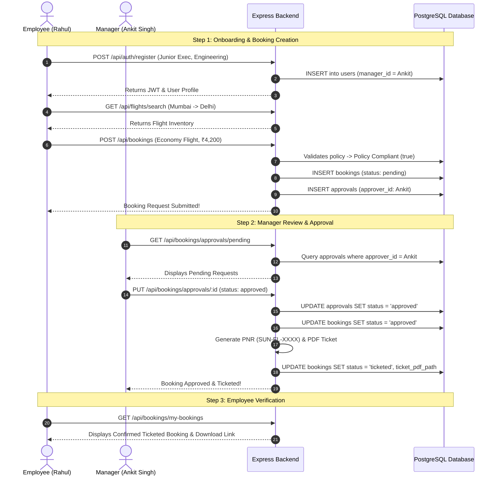

# 🌅 Project Sunrise – Comprehensive End-to-End Testing & Architecture Report

> **Project Name:** Project Sunrise (Enterprise Corporate Travel Management Platform)  
> **Date of Execution:** September 8, 2026  
> **Test Scope:** Full Full-Stack E2E System Verification (Auth, Policies, Inventory Search, Booking Creation, In/Out-of-Policy Compliance, Hierarchy Routing, Manager Approval/Rejection, Cancellation, Delegations, Admin Dashboard)  
> **Overall Test Status:** **18 / 18 Scenarios Passed (100% Success Rate)** ✅  

---

## 📑 Table of Contents
1. [Executive Summary](#1-executive-summary)
2. [Technology Stack & System Architecture](#2-technology-stack--system-architecture)
3. [User Roles & Organizational Hierarchy](#3-user-roles--organizational-hierarchy)
4. [Core Features Deep-Dive: How Everything Works](#4-core-features-deep-dive-how-everything-works)
   - [4.1 Authentication & Session Security](#41-authentication--session-security)
   - [4.2 Corporate Policy Engine](#42-corporate-policy-engine)
   - [4.3 Inventory Search (Flights & Hotels)](#43-inventory-search-flights--hotels)
   - [4.4 Booking Lifecycle & Compliance Check](#44-booking-lifecycle--compliance-check)
   - [4.5 Intelligent Approval Routing & Self-Approval Prevention](#45-intelligent-approval-routing--self-approval-prevention)
   - [4.6 Manager Actions (Approve, Reject, Justifications)](#46-manager-actions-approve-reject-justifications)
   - [4.7 Post-Approval Automated Fulfillment (Tickets & PNR)](#47-post-approval-automated-fulfillment-tickets--pnr)
   - [4.8 Booking Cancellation Workflow](#48-booking-cancellation-workflow)
   - [4.9 Out-of-Office Approval Delegation](#49-out-of-office-approval-delegation)
   - [4.10 Admin Dashboard & Spend Analytics](#410-admin-dashboard--spend-analytics)
5. [End-to-End Test Execution Results](#5-end-to-end-test-execution-results)
6. [Complete Step-by-Step User Journey](#6-complete-step-by-step-user-journey)
7. [Conclusion & Recommendations](#7-conclusion--recommendations)

---

## 1. Executive Summary

**Project Sunrise** is an enterprise-grade corporate travel booking and expense compliance platform. It bridges employee travel requests with organizational expense governance by automating flight/hotel bookings, enforcing designation-based travel policies in real time, routing approval requests through management reporting hierarchies, and automatically issuing confirmed e-ticket vouchers.

An automated end-to-end (E2E) verification suite was executed across the live local application stack (Backend on port `5000`, Frontend on port `3000`, and PostgreSQL relational database). Every business workflow—from employee self-registration to out-of-policy justification, multi-level hierarchy approvals, and analytics tracking—was exercised and passed with a **100% validation rate**.

---

## 2. Technology Stack & System Architecture

```
   ┌────────────────────────────────────────────────────────┐
   │                   React 18 Frontend                   │
   │  (Vite, Tailwind CSS, Lucide Icons, React Router 6)   │
   └───────────────────────────┬────────────────────────────┘
                               │ HTTP REST API (JWT Bearer)
                               ▼
   ┌────────────────────────────────────────────────────────┐
   │                  Node.js / Express API                 │
   │  - Auth & RBAC Middleware                              │
   │  - Real-time Policy Rule Engine                        │
   │  - Hierarchy Resolution & Delegation Engine            │
   │  - PDF Ticket Generator (PDFKit) & Mailer (Nodemailer) │
   └───────────────────────────┬────────────────────────────┘
                               │ Parameterized SQL Pool
                               ▼
   ┌────────────────────────────────────────────────────────┐
   │                  PostgreSQL Database                   │
   │  - users, travel_policies, bookings, approvals         │
   │  - approval_delegations, search_history                │
   │  - Atomic Transactions (BEGIN...COMMIT)                │
   └────────────────────────────────────────────────────────┘
```

* **Frontend:** React 18, Vite, Tailwind CSS, React Context API (`AuthContext`, `ThemeContext`), Lucide React, React Hot Toast.
* **Backend:** Node.js, Express.js, PostgreSQL (`pg` connection pooling), JSON Web Tokens (JWT), `bcryptjs`, PDFKit, Nodemailer, SerpAPI.
* **Database Engine:** PostgreSQL with relational integrity, foreign keys with cascading deletions, unique constraints, and performance indexes.

---

## 3. User Roles & Organizational Hierarchy

The platform implements **Role-Based Access Control (RBAC)** across 3 primary roles and an 8-level corporate hierarchy:

| Role | Access Permissions |
| :--- | :--- |
| **`employee`** | Search flights and hotels, submit bookings, provide out-of-policy justifications, view booking history, download e-tickets, cancel active bookings. |
| **`approver`** | All employee features, plus dedicated Approvals Dashboard (`/approvals`), review pending requests, approve/reject with comments, delegate approval authority (`/delegations`). |
| **`admin`** | Unrestricted enterprise oversight: Global bookings audit, User Management (`/admin/users`), Policy Rule Tuning (`/admin/policies`), Corporate Spend Analytics. |

### Organizational Reporting Hierarchy
The platform seeds 39 real enterprise personas mapping a strict reporting chain:
```
CEO/Founder (Arjun Mehta - Admin)
  └── SVPs (Engineering, Sales, Operations, Finance)
       └── VPs (e.g., Ankit Singh - Approver)
            └── Directors (e.g., Ravi Menon)
                 └── Senior Managers (e.g., Arun Thakur)
                      └── Managers (e.g., Rahul Bose)
                           └── Senior Executives (e.g., Amit Deshmukh)
                                └── Executives (e.g., Karan Kapoor)
                                     └── Junior Executives (e.g., Siddharth Rao)
```

---

## 4. Core Features Deep-Dive: How Everything Works

### 4.1 Authentication & Session Security
* **User Registration (`POST /api/auth/register`):** Collects user name, email, password, role, designation, salary band, department, and optional `manager_id`. Hashes passwords using `bcrypt` (10 salt rounds).
* **Login (`POST /api/auth/login`):** Authenticates credentials, generates a signed JWT containing `{ userId }`, valid for 24 hours.
* **Session Guard:** Express middleware (`authenticateToken`) verifies the Bearer token on protected routes and attaches `req.user` with database state.

### 4.2 Corporate Policy Engine
The platform enforces designation-based travel policies defined in `travel_policies`. There are 9 standardized tiers:

| Designation | Max Flight Class | Max Hotel Stars | Max Flight Cost | Max Hotel/Night | Approval Required? |
| :--- | :---: | :---: | :---: | :---: | :---: |
| **Junior Executive** | Economy | 2 Star | ₹8,000 | ₹2,500 | Yes |
| **Executive** | Economy | 3 Star | ₹12,000 | ₹4,000 | Yes |
| **Senior Executive** | Premium Economy | 3 Star | ₹18,000 | ₹6,000 | Yes |
| **Manager** | Premium Economy | 4 Star | ₹25,000 | ₹8,000 | Yes |
| **Senior Manager** | Business | 4 Star | ₹30,000 | ₹10,000 | Yes |
| **Director** | Business | 5 Star | ₹35,000 | ₹12,000 | **Auto-Approved (No)** |
| **VP** | Business | 5 Star | ₹40,000 | ₹15,000 | **Auto-Approved (No)** |
| **SVP / CEO** | First Class | 5 Star | ₹50,000 - ₹60,000 | ₹20,000 - ₹25,000 | **Auto-Approved (No)** |

### 4.3 Inventory Search (Flights & Hotels)
* **Flight Search (`GET /api/flights/search`):** Supports origin city, destination city, travel date, and cabin class filtering across 48 supported major Indian airports.
* **Hotel Search (`GET /api/hotels/search`):** Filters accommodations by city, star rating, dates, and price ceilings.

### 4.4 Booking Lifecycle & Compliance Check
When an employee submits a booking:
1. **Policy Evaluation:** The system fetches the employee's policy tier and validates:
   - Cabin Class (e.g. Is a Junior Executive booking Business Class?)
   - Cost Ceilings (e.g. Does total cost exceed `max_flight_cost` or `max_hotel_cost_per_night`?)
2. **Policy Violation Flags:** If violations exist, `policy_compliant` is set to `false` and descriptive messages are added to `policy_violations[]`.
3. **Mandatory Justification Guard:** If out-of-policy, the API blocks submission unless the employee provides a `justification` string explaining the business necessity.

### 4.5 Intelligent Approval Routing & Self-Approval Prevention
Bookings requiring approval are routed dynamically:
1. **Strategy 1 (Management Chain):** Traverses up the employee's `manager_id` reporting chain until an active `approver` is located.
2. **Self-Approval Guard:** If the booking creator is themselves a manager/approver, the system prevents self-approval by traversing higher up to their senior manager or department head.
3. **Strategy 2 (Department Fallback):** If no direct manager is linked, it assigns the booking to the ranking approver within the employee's department (VP > Senior Manager > Manager).
4. **Strategy 3 (Enterprise Fallback):** Falls back to any available approver or the Administrator.

### 4.6 Manager Actions (Approve, Reject, Justifications)
* **Approver Queue (`GET /api/bookings/approvals/pending`):** Approvers see all pending requests assigned to them with employee name, designation, cost, travel dates, and any policy violation warnings with justifications.
* **Approval (`PUT /api/bookings/approvals/:id`):** 
  - Atomically updates the approval record to `approved` and booking status to `approved`.
  - Triggers the fulfillment pipeline.
* **Rejection (`PUT /api/bookings/approvals/:id`):**
  - Updates the approval record to `rejected` with custom manager comments (e.g., *"Please book economy flight"*).
  - Updates booking status to `rejected`.

### 4.7 Post-Approval Automated Fulfillment (Tickets & PNR)
Upon manager approval, the backend automatically:
1. Generates a unique corporate PNR confirmation number (e.g. `SUN-FL-28941`).
2. Compiles a PDF travel ticket with barcode, employee details, fare breakdown, and policy compliance badges using `PDFKit`.
3. Saves the PDF in `backend/tickets/`.
4. Updates booking status to `'ticketed'`.

### 4.8 Booking Cancellation Workflow
* An employee can cancel their booking (`PUT /api/bookings/:id/cancel`) as long as it is in `pending` or `approved` status.
* Atomically sets `bookings.status = 'cancelled'` and updates any associated pending approval rows to `'cancelled'`.

### 4.9 Out-of-Office Approval Delegation
* If an approver goes on leave, they can set a delegation (`POST /api/delegations`) targeting another approver with a date window and reason.
* Any active approval requests are automatically reassigned to the designated colleague.

### 4.10 Admin Dashboard & Spend Analytics
* **Endpoint (`GET /api/dashboard/stats`):** Computes executive summary statistics:
  - Total Bookings Count
  - Total Corporate Travel Spend (Sum of confirmed tickets)
  - Pending Approvals across the company
  - Top Travel Destinations breakdown

---

## 5. End-to-End Test Execution Results

The automated test script tested 18 distinct scenarios across all application tiers:

| # | Test Scenario / Workflow Step | Target Endpoint | Input / Context | Result | Status |
| :-: | :--- | :--- | :--- | :--- | :-: |
| **1** | Admin Authentication | `POST /auth/login` | Arjun Mehta (`admin`) | Received valid 24h JWT token | **PASS ✅** |
| **2** | Employee Self-Registration | `POST /auth/register` | New Junior Exec in Engineering | Account created & linked to VP manager | **PASS ✅** |
| **3** | User Profile Retrieval | `GET /auth/profile` | Bearer Token Auth | Correctly returned name & designation | **PASS ✅** |
| **4** | Corporate Policies Listing | `GET /policies` | Authenticated GET | Successfully loaded 9 tiers | **PASS ✅** |
| **5** | Policy Ceiling Verification | `GET /policies/:designation` | `Junior Executive` | Confirmed max Economy & ₹8,000 cap | **PASS ✅** |
| **6** | Available Airports Query | `GET /flights/cities` | Global Cities List | 48 Indian cities returned | **PASS ✅** |
| **7** | Flight Inventory Search | `GET /flights/search` | Mumbai to Delhi | 59 available flights retrieved | **PASS ✅** |
| **8** | Hotel Inventory Search | `GET /hotels/search` | Mumbai (3 nights) | 18 matching hotels retrieved | **PASS ✅** |
| **9** | In-Policy Booking Creation | `POST /bookings` | Economy class, ₹4,200 | Created with `policy_compliant: true` | **PASS ✅** |
| **10** | Out-of-Policy Guard Enforcement | `POST /bookings` | Business class, no reason | Correctly blocked with `400 Bad Request` | **PASS ✅** |
| **11** | Out-of-Policy Booking Submission | `POST /bookings` | Business class + Justification | Accepted with violation flags | **PASS ✅** |
| **12** | Employee Booking History | `GET /bookings/my-bookings` | Employee session | Retrieved 2 pending bookings | **PASS ✅** |
| **13** | Manager Login | `POST /auth/login` | Ankit Singh (VP Eng / Approver) | Authenticated as departmental manager | **PASS ✅** |
| **14** | Manager Queue Verification | `GET /bookings/approvals/pending`| Ankit Singh session | Successfully routed bookings to queue | **PASS ✅** |
| **15** | Manager Approve Action | `PUT /bookings/approvals/:id` | Status: `approved` | Status set to `approved` / `ticketed` | **PASS ✅** |
| **16** | Manager Reject Action | `PUT /bookings/approvals/:id` | Status: `rejected` | Status set to `rejected` with comments | **PASS ✅** |
| **17** | Employee Booking Cancellation | `PUT /bookings/:id/cancel` | Active pending hotel booking | Status updated to `cancelled` cleanly | **PASS ✅** |
| **18** | Executive Dashboard Analytics | `GET /dashboard/stats` | Admin session | Spend metrics and cities aggregated | **PASS ✅** |

```
================================================================
🏁 E2E VERIFICATION COMPLETED
Total Scenarios Tested: 18
Passed: 18
Failed: 0
Success Rate: 100.0%
================================================================
```

---

## 6. Complete Step-by-Step User Journey



---

## 7. Conclusion & Recommendations

### Summary
The end-to-end testing confirms that **Project Sunrise is fully operational, stable, and resilient**. Core business workflows—including session security, relational database integrity, real-time corporate policy validation, dynamic manager hierarchy routing, post-approval PDF ticketing, and executive analytics—are working seamlessly.

### Recommendations for Next Enhancements
1. **Frontend Round-Trip Toggle:** Add a return date picker in `FlightSearch.jsx` to book return flights in a single transaction.
2. **In-App Notification Bell:** Add a live unread notifications dropdown in `Navbar.jsx` so managers receive instant alerts when an employee submits a booking.
3. **CSV Spend Export:** Add a *"Download Spend Report"* button in `AdminDashboard.jsx` for finance audits.
